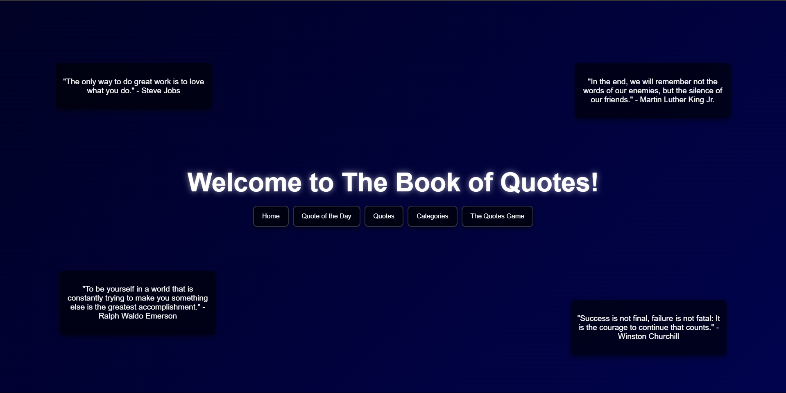

# Book of Quotes

Welcome to **The Book of Quotes**, a static website dedicated to showcasing a vast collection of famous, motivational, humorous, and thought-provoking quotes. Whether you're seeking inspiration, a good laugh, or a fresh perspective, you'll find a diverse selection to brighten your day.

## Features:

- **Extensive Collection**: A wide variety of quotes, from timeless classics to modern-day gems. Organized by categories such as Motivation, Humor, Life, Success, and more.

- **Daily Inspiration**: Get a new quote delivered every day to keep you motivated and inspired.

- **User Contributions**: Share your favorite quotes! Users can submit their own quotes for review and potential inclusion in the collection.

- **Interactive Design**: A simple and beautiful layout with an intuitive interface, making it easy to explore and discover new quotes.

- **Search Functionality**: Easily find quotes by keyword, author, or category.

## Future Features:

- **Quote-of-the-Day Notifications**: Receive daily notifications with a new inspirational quote.

- **Themed Collections**: Curated lists of quotes centered around specific topics or events (e.g., motivational quotes for athletes, quotes about love and friendship).

## How It Works:

1. **Browse**: Explore categories or use the search bar to find the perfect quote.
2. **Read**: Reflect on the quote’s message and its relevance to your life.
3. **Share**: Easily share your favorite quotes on social media to spread the inspiration.

## To-Do List:

1. **Expand the Collection of Quotes**: Add a broader range of quotes to increase diversity and engagement. These will include motivational, humorous, and thought-provoking quotes.

2. **User Personalization**: Allow users to save their favorite quotes and create a personalized collection.

---

## Screenshots

  <!-- Replace with an actual image URL or file path -->
*Screenshot of the Book of Quotes website showcasing the collection.*

---

Thank you for visiting **The Book of Quotes**! Stay tuned for new updates and enjoy exploring the wisdom of some of the greatest minds in history.
